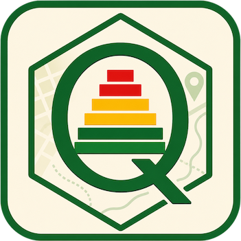

# Q-CensosBo

  

Plugin de **QGIS** para consultar y mapear los microdatos de los censos de población de
Bolivia (**1976, 1992, 2001, 2012 y 2024**) directamente dentro de QGIS, sin descargar archivos
pesados. Basado en el trabajo del paquete de R [**censosbo**](https://github.com/lab-tecnosocial/censosbo)

## Qué hace

- Consulta los microdatos de forma remota y veloz con DuckDB.
- Calcula indicadores por **departamento** o **municipio**: conteo, media, mediana, suma,
  desviación, moda y porcentaje de una categoría.
- Reconoce variables categóricas y numéricas y muestra etiquetas legibles.
- Genera mapas coropléticos con leyenda apropiada y un resumen del resultado.

## Instalación

Descarga
[`qcensosbo.zip`](https://github.com/lab-tecnosocial/q-censosbo/releases/latest/download/qcensosbo.zip) e instálalo en QGIS con
*Complementos → Administrar e instalar complementos… → Instalar a partir de ZIP*.

Requisitos: QGIS ≥ 3.28 e internet. DuckDB se instala solo la primera vez.

## Documentación

Guía completa en: https://lab-tecnosocial.github.io/q-censosbo/

## Datos

Microdatos del paquete [**censosbo**](https://github.com/lab-tecnosocial/censosbo) (censos de
Bolivia, formato Parquet).

## Licencia

GPL-3.0. Ver [LICENSE](LICENSE).
