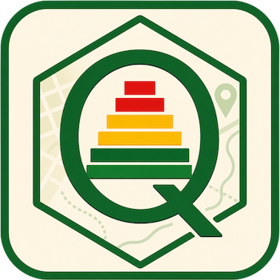

# Q-CensosBo

  

  
  
  

Plugin de **QGIS** para consultar y mapear los microdatos de los censos de población de
Bolivia (**1976, 1992, 2001, 2012 y 2024**) directamente dentro de QGIS, sin descargar archivos
pesados. Basado en el trabajo del paquete de R [**censosbo**](https://github.com/lab-tecnosocial/censosbo)

## Qué hace

- Consulta los microdatos de forma remota y veloz con DuckDB.
- Calcula indicadores por **departamento** o **municipio**: conteo, media, mediana, suma,
  desviación, moda y porcentaje de una categoría, con **los dos denominadores** —entre los casos con
  dato (el que reproduce las cifras del INE) o sobre todos los registros—, diciendo siempre cuál está
  en juego.
- Mapea el CPV-2024 por **manzano urbano y comunidad rural**: 268.604 unidades censales con
  194 indicadores de la ficha del INE (245 opciones con las que suman ambos sexos), de a un
  municipio.
- Reconoce variables categóricas y numéricas y muestra etiquetas legibles.
- Acota las variables por **tema** del catálogo del INE (o por **bloque** en las fichas) y declara
  **a quién se le hizo cada pregunta** —el universo del diccionario **y los saltos del
  cuestionario**—, que es lo que decide si un resultado se puede leer como «de la población». El
  tooltip trae la documentación oficial: qué mide y la pregunta tal como se leyó.
- Marca las **celdas frágiles**: cuenta las unidades que calculan su valor sobre menos de 5 casos y
  pone el tamaño de muestra de cada una en el campo `casos_censo` de la capa.
- Convierte cualquier conteo o suma en **densidad por km²** con una casilla.
- Genera mapas coropléticos con leyenda apropiada y un resumen que anticipa las clases del mapa
  y declara lo que queda fuera del cálculo.

## Instalación

Desde QGIS, en *Complementos → Administrar e instalar complementos…*, busca **Q-CensosBo** e
instálalo. Está en el [repositorio oficial de complementos](https://plugins.qgis.org/plugins/qcensosbo/),
así que también recibirás los avisos de actualización.

Como alternativa, puedes instalar el
[ZIP](https://github.com/lab-tecnosocial/q-censosbo/releases/latest/download/qcensosbo.zip) con
*Instalar a partir de ZIP*.

Requisitos: QGIS ≥ 3.28, incluido QGIS 4, e internet. DuckDB se instala solo la primera vez.

## Documentación

Guía completa en: https://lab-tecnosocial.github.io/q-censosbo/

## Datos

Microdatos del paquete [**censosbo**](https://github.com/lab-tecnosocial/censosbo) (censos de
Bolivia, formato Parquet).

## Licencia

GPL-3.0. Ver [LICENSE](LICENSE).
